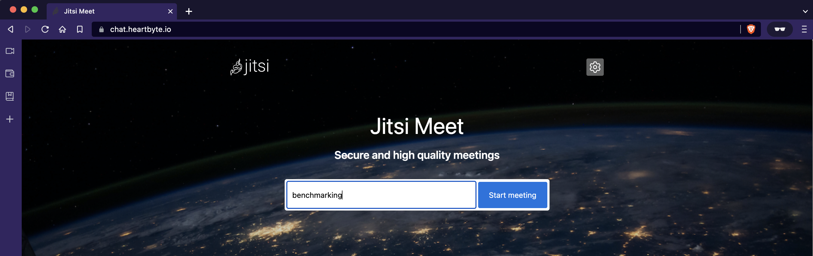
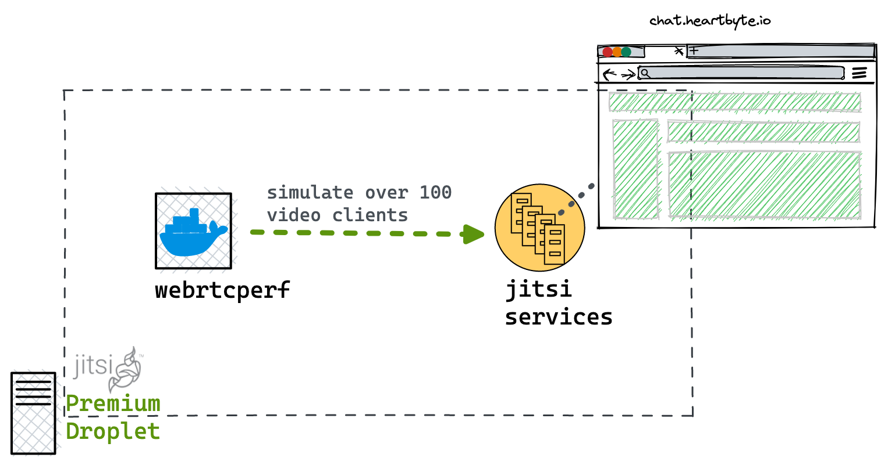
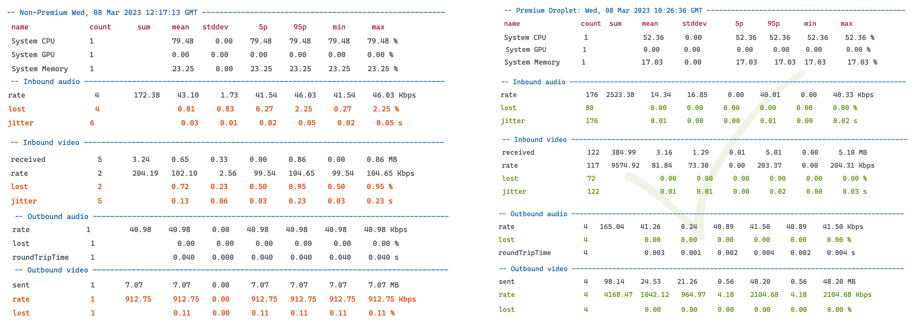

# Benchmarking Jitsi: WebRTC-based Video Conferencing Platform

## Introduction

For businesses with data-intensive workloads, utilizing [Premium CPU-Optimized Droplets](https://www.digitalocean.com/blog/introducing-premium-cpu-optimized-droplets) can maximize app performance reliability while leveraging higher outbound data speeds for faster and smoother user experience. These Droplets also make it easy to scale operations, particularly for ML and AI development and training. Some of the ideal workloads include,

* **Media streaming**

* **Analytics, data warehousing & machine learning**
* **Network & CPU intensive workloads: IoT, web crawling, real-time comm, ad-serving**

In this project, we will pick one of the use cases, "*media streaming*," and analyze how a real-world video conferencing platform performs on the newly launched droplets. Furthermore, we will also run a similar setup on the "non-premium droplets" to compare the performance.

## Benchmarking a Video Streaming Application

### The setup

The benchmark setup consists of

* [Jitsi server](https://github.com/jitsi/jitsi-meet), a popular open-source video conferencing application that allows users to create and customize their video conferencing server to their specific needs.
* CPU-Optimized Premium droplet

    ```code
    spec: 96 GB Memory / 48 Intel vCPUs / AMS3 - Ubuntu 22.04 (LTS) x64
    ```

* CPU Optimized Non-Premium droplet

    ```code
    spec: 96 GB Memory / 48 Intel vCPUs / FRA1 - Ubuntu 22.04 (LTS) x64
    ```

* [webrtcperf](https://github.com/vpalmisano/webrtcperf), a benchmarking to test webrtc-based applications. This tool is also used to simulate over 100 users per video session.

> *The tests were run on both the premium and the non-premium droplets throughout a twenty-minute video conference call*

### Installation & configuration

* DigitalOcean offers a [1-click installation](https://marketplace.digitalocean.com/apps/jitsi-server) of Jitsi Server through our [Marketplace](https://marketplace.digitalocean.com/), making it easy for users to set up and get started with video conferencing.

* Before accessing the droplet, add a domain to the project. For example, `chat.heartbyte.io` This is required because most browsers require HTTPS to allow to use of the camera and microphone on a website, and it is impossible to enable HTTPS just with an IP. [Follow this guide](https://www.digitalocean.com/docs/networking/dns/how-to/add-domains/) to configure the `A record` for the public IP of the droplet.

* Configure the Jitsi server

    ```bash
    # Access the droplet
    ssh root@droplet-ip
    # Run the setup script and follow the instructions on the console
    ./complete-jitsi-setup.sh
    ```

Upon successful configuration, one should be able to access the start the `Jitsi Meet` session as shown below,

<p align="center">
  
</p>

> Note: If you chose to skip the 1-click install, then you can run the [`complete-jitsi-setup.sh`](./scripts/complete-jitsi-setup.sh) on the VM of your choice

### Benchmarking

Jitsi is a [WebRTC](https://webrtc.org/)-based video conferencing platform, and `webrtcperf` is a WebRTC performance and quality evaluation tool.

* It validates audio/video quality and the client CPU/memory usage when multiple connections join the same WebRTC service.
* It can be executed from sources using the pre-built Docker image or with the executables generated for each platform.
* It allows for throttling the networking configuration, limiting the ingress/egress available bandwidth, the RTT, or the packet loss %.

```bash
# Using containerized webrtcperf tool to simulate over 100 clients 
docker pull ghcr.io/vpalmisano/webrtcperf
# Edit the `--url` flag with the jitsi meet URL
docker run -it --rm \
    -v /dev/shm:/dev/shm \
    ghcr.io/vpalmisano/webrtcperf \
    --url="https://chat.heartbyte.io/benchmark#config.prejoinPageEnabled=false" \
    --show-page-log=false \
    --sessions=1 \
    --tabs-per-session=100
```

Or you can run the [`webrtc-test.sh`](./scripts/webrtc-test.sh) with custom options.

<p align="left">
  
</p>

#### Benchmarking in action

* `webrtcperf` has the instrumentation to measure the application’s performance running on the droplet
* We are streaming over 100 Linus Torvalds TED talks to the configured Jitsi server for simulation purposes

<p align="center">
  
</p>

Once the benchmarking is done, you can either stop the proces by pressing `q` in the terminal where the clients are running or run the [`stop-containers.sh`](./scripts/stop-containers.sh) script.

### Results

Several key metrics are used to measure the performance and quality of video streaming applications. These metrics include:

* **Bitrate(Audio/Video)**: Bitrate refers to the amount of data transmitted per second and is usually measured in kilobits per second (kbps) or megabits per second (Mbps). Higher bitrates generally result in higher-quality video but also require more bandwidth and may be more prone to buffering and other performance issues
* **Packet loss(Audio/Video)** is a metric measuring the percentage of data packets lost in transit between two devices. A higher packet loss rate can indicate network congestion or connectivity issues, which can affect a machine's performance
* **Jitter** is a metric that measures the variation in the time it takes for data packets to reach their destination. Jitter can be caused by network congestion, packet buffering, and other factors that can cause delays in packet transmission. Higher jitter values can lead to increased latency and reduced network performance
* **System CPU and memory** performance

#### Observations

As expected, the Premium CPU-optimized droplets outperformed the Non-Premium droplets,

* **34.1% better** CPU performance
* **26.75% less** System memory usage
* Bitrate
  * Video: **130.5% improvement** in video outbound bitrate
  * Audio: **1.26% improvement** in audio outbound bitrate
* Packet loss
  * Video: **0% packet loss** on the Premium droplets while non-premium experienced a 0.95% packet loss
  * Audio: **0% packet loss** on the Premium droplets, while non-premium experienced a 2.25% packet loss
* Jitter
  * Video: **86.95% less** jitter
  * Audio: **60% less** jitter

> Note: The benchmarking results might vary depending on hardware configuration, software settings, testing methodologies, and the specific workloads. Therefore, it is crucial to interpret benchmarking results cautiously and consider the context and variables involved in each test.

<p align="center">
  
</p>

### References

* [Blog: Premium CPU Optimized Droplets](https://www.digitalocean.com/blog/introducing-premium-cpu-optimized-droplets)
* [Video: Spin up Premium Droplets](https://youtu.be/SGb14pC7TDs)

### Stats for nerds

```bash
-- Premium Droplets -------------------------------------------------------------------
                          name    count      sum     mean   stddev       5p      95p      min      max
                    System CPU        1             52.36     0.00    52.36    52.36    52.36    52.36 %
                    System GPU        1              0.00     0.00     0.00     0.00     0.00     0.00 %
                 System Memory        1             17.03     0.00    17.03    17.03    17.03    17.03 %
                      CPU/page        1    71.04    71.04     0.00    71.04    71.04    71.04    71.04 %
                   Memory/page        1   495.56   495.56     0.00   495.56   495.56   495.56   495.56 MB
                         Pages        3       10        3        0        2        4        2        4
                        Errors        1      795      795        0      795      795      795      795
                      Warnings        1     1301     1301        0     1301     1301     1301     1301
              Peer Connections        3        6        2        1        0        4        0        4
-- Inbound audio -----------------------------------------------------------------------------------
                          rate      176  2523.38    14.34    16.85     0.00    40.01     0.00    40.33 Kbps
                          lost       80              0.00     0.00     0.00     0.00     0.00     0.00 %
                        jitter      176              0.01     0.00     0.00     0.01     0.00     0.02 s
          avgJitterBufferDelay       80            206.82   285.72    60.27  1059.06    52.52  1130.43 ms
-- Inbound video -----------------------------------------------------------------------------------
                      received      122   384.99     3.16     1.29     0.01     5.01     0.00     5.10 MB
                          rate      117  9574.92    81.84    73.30     0.00   203.37     0.00   204.31 Kbps
                          lost       72              0.00     0.00     0.00     0.00     0.00     0.00 %
                        jitter      122              0.01     0.01     0.00     0.02     0.00     0.03 s
          avgJitterBufferDelay       72             98.33    60.17    34.98   271.75    30.06   313.34 ms
                         width      119               320        0      320      320      320      320 px
                        height      119               180        0      180      180      180      180 px
                           fps       42                25        0       25       26       24       27 fps
-- Outbound audio ----------------------------------------------------------------------------------
                          rate        4   165.04    41.26     0.24    40.89    41.50    40.89    41.50 Kbps
                          lost        4              0.00     0.00     0.00     0.00     0.00     0.00 %
                 roundTripTime        4             0.003    0.001    0.002    0.004    0.002    0.004 s
-- Outbound video ----------------------------------------------------------------------------------
                          sent        4    98.14    24.53    21.26     0.56    48.20     0.56    48.20 MB
                          rate        4  4168.47  1042.12   964.97     4.18  2104.68     4.18  2104.68 Kbps
                          lost        4              0.00     0.00     0.00     0.00     0.00     0.00 %
                 roundTripTime        4             0.003    0.001    0.002    0.004    0.002    0.004 s
 qualityLimitResolutionChanges        4      162       40       25        0       63        0       63
          qualityLimitationCpu        4       92       23       23        0       54        0       54 %
    qualityLimitationBandwidth        4        0        0        0        0        0        0        0 %
                sentMaxBitrate        4  7200.00  1800.00  1600.00   200.00  3400.00   200.00  3400.00 Kbps
                         width        4               800      480      320     1280      320     1280 px
                        height        4               450      270      180      720      180      720 px
                           fps        4                22        5       13       25       13       25 fps
              pliCountReceived        4               101       57       11      166       11      166
```

----

```bash
-- Non-Premium Droplets -------------------------------------------------------------------
                          name    count      sum     mean   stddev       5p      95p      min      max
                    System CPU        1             79.48     0.00    79.48    79.48    79.48    79.48 %
                    System GPU        1              0.00     0.00     0.00     0.00     0.00     0.00 %
                 System Memory        1             23.25     0.00    23.25    23.25    23.25    23.25 %
                      CPU/page        1    77.49    77.49     0.00    77.49    77.49    77.49    77.49 %
                   Memory/page        1   516.25   516.25     0.00   516.25   516.25   516.25   516.25 MB
                         Pages        2       10        5        4        1        9        1        9
                        Errors        1      684      684        0      684      684      684      684
                      Warnings        1     1576     1576        0     1576     1576     1576     1576
              Peer Connections        2        1        0        0        0        1        0        1
-- Inbound audio -----------------------------------------------------------------------------------
                          rate        4   172.38    43.10     1.73    41.54    46.03    41.54    46.03 Kbps
                          lost        4              0.81     0.83     0.27     2.25     0.27     2.25 %
                        jitter        6              0.03     0.01     0.02     0.05     0.02     0.05 s
          avgJitterBufferDelay        4            496.07    13.69   474.57   512.30   474.57   512.30 ms
-- Inbound video -----------------------------------------------------------------------------------
                      received        5     3.24     0.65     0.33     0.00     0.86     0.00     0.86 MB
                          rate        2   204.19   102.10     2.56    99.54   104.65    99.54   104.65 Kbps
                          lost        2              0.72     0.23     0.50     0.95     0.50     0.95 %
                        jitter        5              0.13     0.06     0.03     0.23     0.03     0.23 s
          avgJitterBufferDelay        2             50.43    11.21    39.22    61.64    39.22    61.64 ms
                         width        4               300       34      240      320      240      320 px
                        height        4               168       19      135      180      135      180 px
-- Outbound audio ----------------------------------------------------------------------------------
                          rate        1    40.98    40.98     0.00    40.98    40.98    40.98    40.98 Kbps
                          lost        1              0.00     0.00     0.00     0.00     0.00     0.00 %
                 roundTripTime        1             0.040    0.000    0.040    0.040    0.040    0.040 s
-- Outbound video ----------------------------------------------------------------------------------
                          sent        1     7.07     7.07     0.00     7.07     7.07     7.07     7.07 MB
                          rate        1   912.75   912.75     0.00   912.75   912.75   912.75   912.75 Kbps
                          lost        1              0.11     0.00     0.11     0.11     0.11     0.11 %
                 roundTripTime        1             0.036    0.000    0.036    0.036    0.036    0.036 s
 qualityLimitResolutionChanges        1       63       63        0       63       63       63       63
          qualityLimitationCpu        1        0        0        0        0        0        0        0 %
    qualityLimitationBandwidth        1        5        5        0        5        5        5        5 %
                sentMaxBitrate        1  3400.00  3400.00     0.00  3400.00  3400.00  3400.00  3400.00 Kbps
                         width        1              1280        0     1280     1280     1280     1280 px
                        height        1               720        0      720      720      720      720 px
                           fps        1                 8        0        8        8        8        8 fps
              pliCountReceived        1               242        0      242      242      242      242
```
